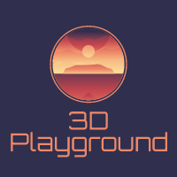
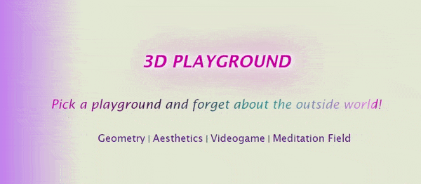
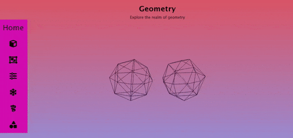
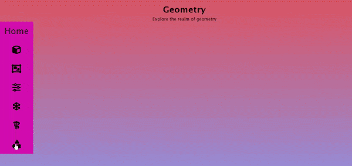
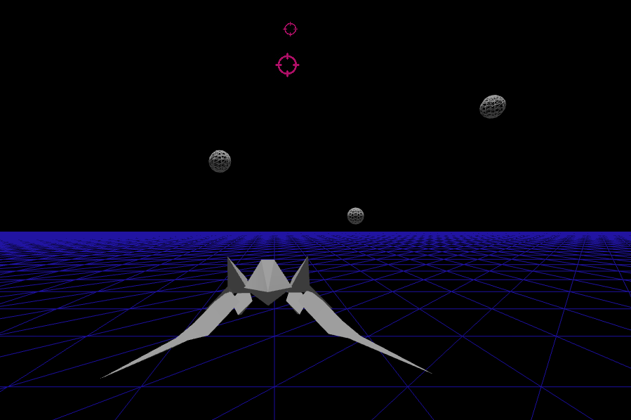
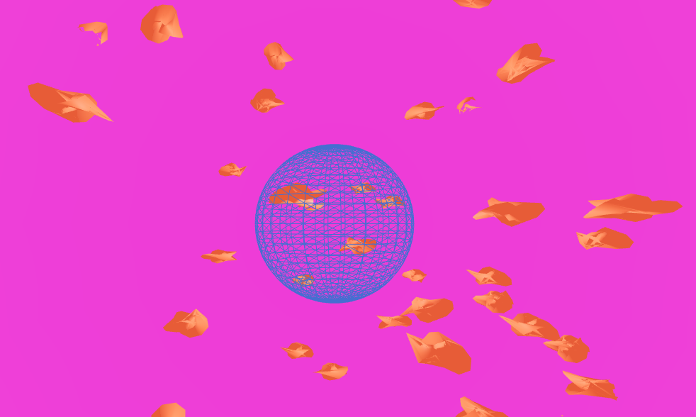

<h1 align="center"> 3DP</h1>

<!--
*** Thanks for checking out the Best-README-Template. If you have a suggestion
*** that would make this better, please fork the repo and create a pull request
*** or simply open an issue with the tag "enhancement".
*** Don't forget to give the project a star!
*** Thanks again! Now go create something AMAZING! :D
-->

<!-- PROJECT LOGO -->
 

    
  </a>

  <h3 align="center">3D Playground</h3>

  

  <i>Pick a playground and forget about the outside world!</i>
      
    <a href="https://threedplayground.netlify.app">Live Site</a>
    ·
    <a href="https://github.com/francescorizzello94/3d-playground/issues">Report Bug</a>
    ·
    <a href="https://github.com/francescorizzello94/3d-playground/issues">Request Feature</a>
  

<!-- TABLE OF CONTENTS -->

  
Table of Contents

  <ol>
    <li>
      <a href="#about-the-project">About The Project</a>
      <ul>
        <li><a href="#built-with">Built With</a></li>
      </ul>
    </li>
    <li>
      <a href="#getting-started">Getting Started</a>
      <ul>
        <li><a href="#prerequisites">Prerequisites</a></li>
        <li><a href="#installation">Installation</a></li>
      </ul>
    </li>
    <li><a href="#usage">Usage</a></li>
    <li><a href="#roadmap">Roadmap</a></li>
    <li><a href="#contributing">Contributing</a></li>
    <li><a href="#license">License</a></li>
    <li><a href="#contact">Contact</a></li>
    <li><a href="#acknowledgments">Acknowledgments</a></li>
  </ol>

<!-- ABOUT THE PROJECT -->
## About The Project

    
  </a>
  

  
  <h2 align="center"> Geometry </h2>

The <i>Geometry</i> playground focuses on the geometrical shape and structure of objects, as well as interactivity; wireframe is used for several animations to provide a more three-dimensional experience, as you can see in the first animation below. Interaction with objects occurs through typical events such as click or mouseover (as in the second animation below), as well as with slider controls.

    
  </a>
  

  
   
  
  

    
  </a>
  

  
  <h2 align="center"> Aesthetics </h2>
  
  
 
The <i>Aesthetics</i> playground offers pure bliss in the form of impressive animations and vaporwave color gradients. 
Find the best example of this in the video below:

https://user-images.githubusercontent.com/63818980/182714509-54092982-0797-4862-8cf6-b102d29b7399.mp4

<h2 align="center"> Videogame </h2>

 

 

    
  </a>
  

   
This very simple game inspired by the <a href="https://www.youtube.com/watch?v=ADBnmJ1Z_18&ab_channel=CodeWorkshop"> following tutorial </a> is a minor videoludic addition to add a more dynamic component to an otherwise relaxed atmosphere.
I mainly used it to learn about the Recoil library and understand how I may implement state management for future videogame projects.

<h2 align="center"> Meditation Field </h2>
 
 

    
  </a>
  

  
<i>Meditation Field</i> is the centerpiece of the project, the point where all the elements of geometry, aesthetics and interaction come together. 
It is inspired by the concept of mindfulness: the user should focus intensely on the wireframe sphere at the center of the screen while being mindful of the existence of the multitude of swirling torus knots around it. The latter represent the myriad of thoughts the crowd our minds and obfuscate our thinking with regard to the essential (the sphere).   By clicking on a torus know, the mindful user selects an element of their cognition to be inspected or simply to be activated in their thinking. At the same time, the thought represented by the torus know remains merely a floating item, rather than a heavy weight on the users's consciousness. 
When the user is done with their inspection, they can click on the item again and thus de-select it. The items continues to to float and swirl as it did before.
Our thoughts never truly leave us, but leave our focus if we want them to.

Here's why:
* Your time should be focused on creating something amazing. A project that solves a problem and helps others
* You shouldn't be doing the same tasks over and over like creating a README from scratch
* You should implement DRY principles to the rest of your life :smile:

Of course, no one template will serve all projects since your needs may be different. So I'll be adding more in the near future. You may also suggest changes by forking this repo and creating a pull request or opening an issue. Thanks to all the people have contributed to expanding this template!

Use the `BLANK_README.md` to get started.

(<a href="#top">back to top</a>)

### Built With

This section should list any major frameworks/libraries used to bootstrap your project. Leave any add-ons/plugins for the acknowledgements section. Here are a few examples.

* [![Next][Next.js]][Next-url]
* [![React][React.js]][React-url]
* [![Vue][Vue.js]][Vue-url]
* [![Angular][Angular.io]][Angular-url]
* [![Svelte][Svelte.dev]][Svelte-url]
* [![Laravel][Laravel.com]][Laravel-url]
* [![Bootstrap][Bootstrap.com]][Bootstrap-url]
* [![JQuery][JQuery.com]][JQuery-url]

(<a href="#top">back to top</a>)

<!-- CONTACT -->
## Contact

Your Name - [@your_twitter](https://twitter.com/your_username) - email@example.com

Project Link: [https://github.com/your_username/repo_name](https://github.com/your_username/repo_name)

(<a href="#top">back to top</a>)

